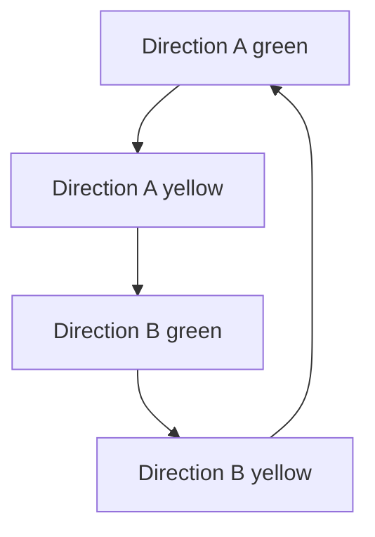

# Arduino Traffic-Light Simulator

**A model intersection with two traffic directions, pedestrian request buttons, and timed crossing signals.**

## About

This Arduino Mega sketch controls two opposing sets of red, yellow, and green vehicle lights. Four push buttons request pedestrian crossings. When a request is detected, the program moves the relevant direction safely through yellow to red, then flashes the corresponding blue pedestrian LEDs.

## Features

- Two-direction intersection cycle
- Five-second green phases
- Two-and-a-half-second yellow phases
- Four active-low pedestrian buttons
- Two pedestrian crossing directions
- Ten-second flashing crossing signal
- Serial output for button diagnostics

## Hardware

- Arduino Mega
- 12 red, yellow, and green traffic LEDs
- 4 blue pedestrian LEDs
- 4 push buttons
- Current-limiting resistors
- Breadboards or PCBs and jumper wires

## Pin map

| System | Arduino pins |
| --- | --- |
| Direction A red/yellow/green | `4`, `3`, `2` and `47`, `45`, `43` |
| Direction B red/yellow/green | `52`, `50`, `48` and `46`, `44`, `42` |
| Pedestrian LEDs | `35`, `37`, `39`, `41` |
| Crossing buttons | `24`, `26`, `28`, `30` |

The buttons use `INPUT_PULLUP`, so connect each button between its input pin and ground.

## Upload

1. Open `TrafficStopAssignmentJonathanShermanAndrew/TrafficStopAssignmentJonathanShermanAndrew.ino`.
2. Select an Arduino Mega in the Arduino IDE.
3. Wire the LEDs with suitable resistors and connect the four buttons.
4. Upload the sketch.
5. Open the Serial Monitor at `9600` baud if you want to inspect button states.

## Program flow

A detected pedestrian request temporarily inserts the matching protected crossing sequence into this loop.
